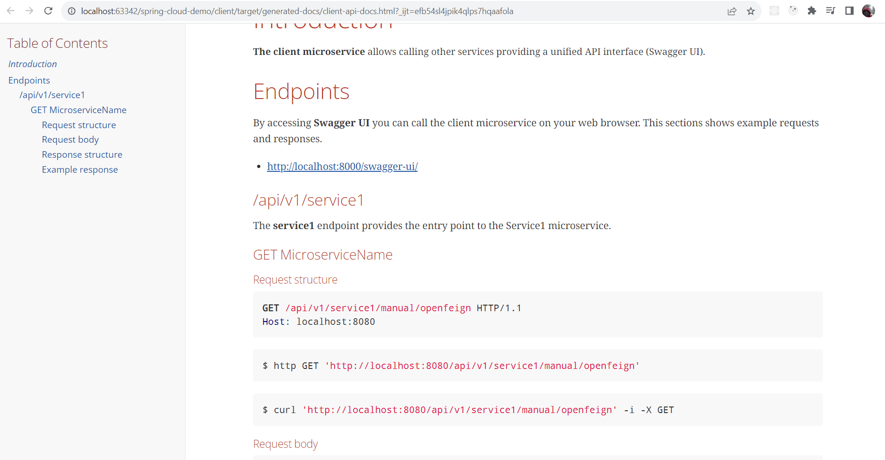

# Spring Cloud demo

| Branch |                                                                                         Pipeline                                                                                         |                                                                                      Code coverage                                                                                       |                                       Test report                                        |                                         Spring REST Docs                                         |                                 SonarCloud                                 |
|:------:|:----------------------------------------------------------------------------------------------------------------------------------------------------------------------------------------:|:----------------------------------------------------------------------------------------------------------------------------------------------------------------------------------------:|:----------------------------------------------------------------------------------------:|:------------------------------------------------------------------------------------------------:|:--------------------------------------------------------------------------:|
| master |  |  | [link](https://showmeyourcodeyoutube.gitlab.io/spring-cloud-demo/test-report/index.html) | [link](https://showmeyourcodeyoutube.gitlab.io/spring-cloud-demo/rest-docs/client-api-docs.html) | [link](https://sonarcloud.io/organizations/showmeyourcodeyoutube/projects) |

## Technology

- JDK (AWS Corretto)
- Spring Boot Cloud
    - OpenFeign
    - Ribbon
    - Eureka
- Spring REST Docs
- Swagger
- WireMock
- RestAssured & Hamcrest

## Services specification

All services use OpenApi3 (OAS3).

- `eureka-server`
  - Technology: Spring MVC
  - Dashboard: http://localhost:8761
  - Port: 8761
- `microservice1`
  - Technology: Spring MVC
  - Swagger UI: http://localhost:8100/microservice1/swagger-ui.html
  - Eureka service name: spring-cloud-eureka-service1
  - Port: 8100
  - Context path: /microservice1
- `microservice2`
  - Technology: Spring MVC
  - Swagger UI: http://localhost:8200/microservice2/swagger-ui.html
  - Eureka service name: spring-cloud-eureka-service2
  - Port: 8200
  - Context path: /microservice2
- `standalone-service`
  - Technology: Spring WebFlux
  - Swagger UI: http://localhost:8300/standalone-microservice/swagger-ui.html
  - Port: 8300
  - Context path: /standalone-microservice
- `client`
  - Technology: Spring MVC
  - Swagger UI: http://localhost:8000/swagger-ui/
  - Eureka service name: spring-cloud-eureka-client
  - Spring REST Docs: client/src/main/asciidoc
  - Port: 8000
- `admin-dashboard`
  - Technology: Spring MVC
  - Dashboard: http://localhost:9000/
  - Port: 9000

## Getting started

1. (Optional) Enable Lombok annotations in your IDE.
2. (Optional) Run all servers using predefined configurations for IntelliJ (.runconfig)
3. Run Eureka server
    - dashboard: localhost:8761
4. Run microservices which will register with Eureka server.
    - microservice1
    - microservice2
    - standalone-service
5. Run a client which will connect to Eureka and call microservices using Eureka.
    - client

### Spring REST Docs vs Springdoc

Reference: https://www.baeldung.com/spring-rest-docs-vs-openapi

**Spring REST Docs** is a framework developed by the Spring community in order to create accurate documentation for RESTful APIs. The output of running the tests is created as AsciiDoc files which can be put together using Asciidoctor to generate an HTML page describing our APIs.

**Springdoc OpenAPI UI** can generate UI using Swagger UI.

## Spring Cloud components

Reference: https://dzone.com/articles/microservice-architecture-with-spring-cloud-and-do

## Swagger 2 vs OpenApi3

**OpenAPI 3 is the successor of the widely used OpenAPI/Swagger 2.0 format, for machine-readable API definitions.**

- Reference: https://dev.to/frolovdev/openapi-spec-swagger-v2-vs-v3-4o7c
- Official documentation: https://spec.openapis.org/oas/v3.1.0

## Spring REST Docs

Spring REST Docs helps you to document RESTful services.

It combines hand-written documentation written with Asciidoctor and auto-generated snippets produced with Spring MVC Test. This approach frees you from the limitations of the documentation produced by tools like Swagger.

It helps you to produce documentation that is accurate, concise, and well-structured. This documentation then allows your users to get the information they need with a minimum of fuss.

Ref: https://spring.io/projects/spring-restdocs#overview

Example implementation - [spring-projects / spring-restdocs](https://github.com/spring-projects/spring-restdocs/blob/2.0.x/samples/rest-notes-spring-data-rest/src/main/asciidoc/api-guide.adoc)
