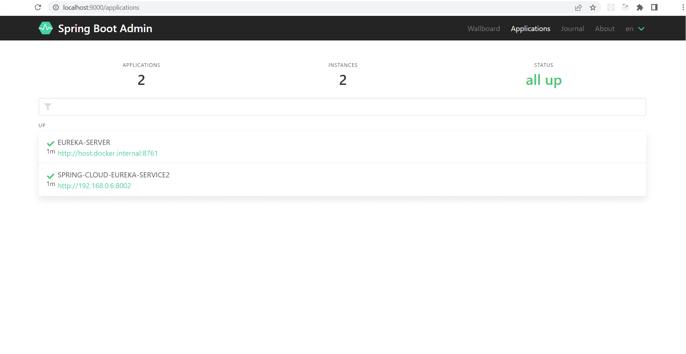
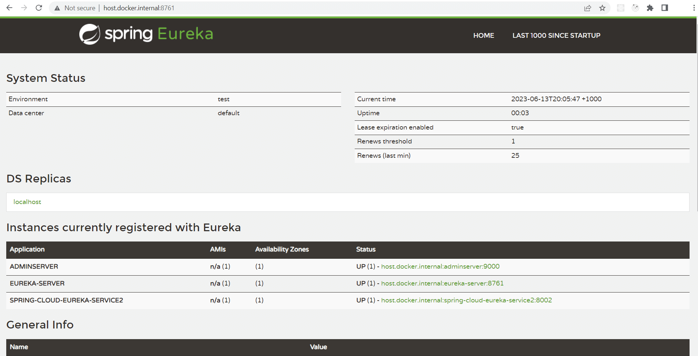
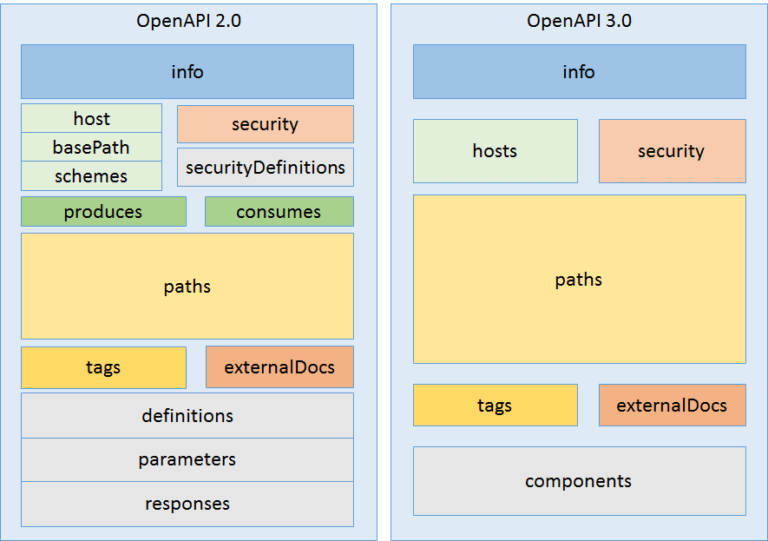

# Spring Cloud demo

| Branch |                                                                                         Pipeline                                                                                         |                                                                                      Code coverage                                                                                       |                                       Test report                                        |
|:------:|:----------------------------------------------------------------------------------------------------------------------------------------------------------------------------------------:|:----------------------------------------------------------------------------------------------------------------------------------------------------------------------------------------:|:----------------------------------------------------------------------------------------:|
| master |  |  | [link](https://showmeyourcodeyoutube.gitlab.io/spring-cloud-demo/test-report/index.html) |

## Technology

- JDK 11 (AWS Corretto)
- Spring Boot Cloud
    - OpenFeign
    - Ribbon
    - Eureka
- Spring REST Docs
- Swagger

## Services specification

- `eureka-server`
    - Dashboard: http://localhost:8761
    - Port: 8761
- `microservice1`
    - SpringFox 3.x
    - Specification: Swagger2
    - Reference: http://localhost:8001/swagger-ui/
    - Eureka service name: spring-cloud-eureka-service1
    - Port: 8001
- `microservice2`
    - springdoc-openapi-ui using Swagger UI
    - Specification: OpenApi3 (OAS3)
    - Reference: http://localhost:8002/swagger-ui.html
    - Eureka service name: spring-cloud-eureka-service2
    - Port: 8002
- `standalone-service`
    - Springfox 2.x
    - Specification: Swagger 2
    - Reference: http://localhost:8100/swagger-ui.html
    - Eureka service name: spring-cloud-eureka-client
    - Port: 8100
- `client`
    - SpringFox 3.x
    - Specification: OpenApi3 (OAS3)
    - Reference: http://localhost:8000/swagger-ui/
    - Eureka service name: spring-cloud-eureka-client
    - Spring REST Docs: client/src/main/asciidoc 
    - Port: 8000
- `admin-dashboard`
    - Dashboard: http://localhost:9000/
    - Port: 9000

## Getting started

1. Run Eureka server
    - dashboard: localhost:8761
2. Run microservices which will register with Eureka server.
    - microservice1
    - microservice2
    - standalone-service
3. Run a client which will connect to Eureka and call microservices using Eureka.
    - client

### Spring REST Docs vs Springdoc

Reference: https://www.baeldung.com/spring-rest-docs-vs-openapi

**Spring REST Docs** is a framework developed by the Spring community in order to create accurate documentation for RESTful APIs. The output of running the tests is created as AsciiDoc files which can be put together using Asciidoctor to generate an HTML page describing our APIs.

**Springdoc OpenAPI UI** can generate UI using Swagger UI.

### Maven commands

- mvn clean install -DskipTests

## Spring Cloud components

Reference: https://dzone.com/articles/microservice-architecture-with-spring-cloud-and-do

## Swagger 2 vs OpenApi3

Reference: https://medium.com/@tgtshanika/open-api-3-0-vs-swagger-2-0-94a80f121022

## References

- https://www.baeldung.com/spring-cloud-netflix-eureka
- https://www.baeldung.com/swagger-2-documentation-for-spring-rest-api
- https://springdoc.org/migrating-from-springfox.html
- https://springdoc.org/faq.html
- https://newbedev.com/how-to-write-integration-tests-with-spring-cloud-netflix-and-feign
- https://www.vojtechruzicka.com/documenting-spring-boot-rest-api-swagger-springfox/
