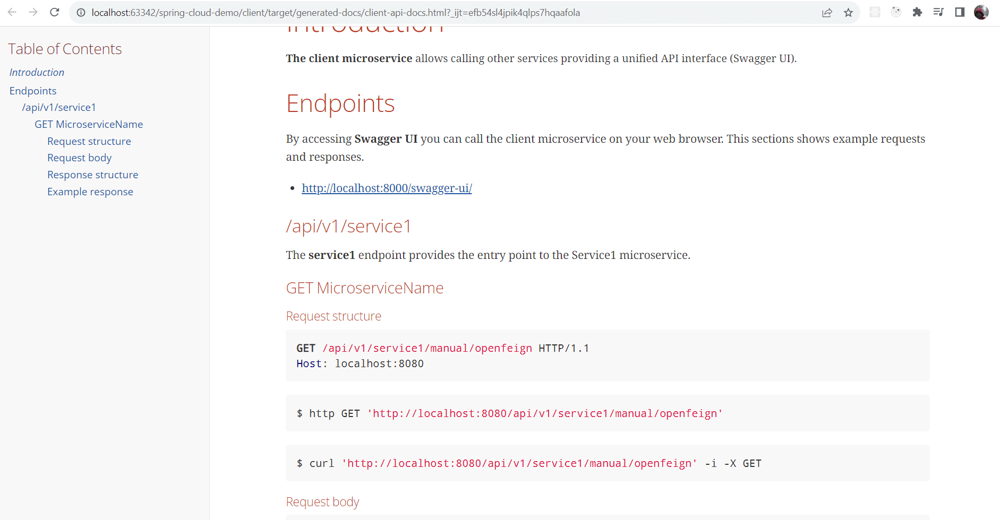
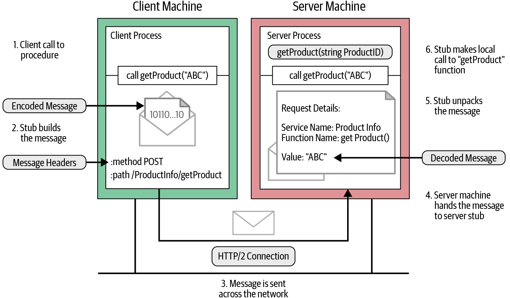

# Spring Cloud demo

| Branch |                                                                                         Pipeline                                                                                         |                                                                                      Code coverage                                                                                       |                                       Test report                                        |                                         Spring REST Docs                                         |                                 SonarCloud                                 |
|:------:|:----------------------------------------------------------------------------------------------------------------------------------------------------------------------------------------:|:----------------------------------------------------------------------------------------------------------------------------------------------------------------------------------------:|:----------------------------------------------------------------------------------------:|:------------------------------------------------------------------------------------------------:|:--------------------------------------------------------------------------:|
| master | [](https://gitlab.com/ShowMeYourCodeYouTube/spring-cloud-demo/-/commits/master) | [](https://gitlab.com/ShowMeYourCodeYouTube/spring-cloud-demo/-/commits/master) | [link](https://showmeyourcodeyoutube.gitlab.io/spring-cloud-demo/test-report/index.html) | [link](https://showmeyourcodeyoutube.gitlab.io/spring-cloud-demo/rest-docs/client-api-docs.html) | [link](https://sonarcloud.io/organizations/showmeyourcodeyoutube/projects) |


## Technology

- JDK (AWS Corretto)
- Spring Boot Cloud
    - OpenFeign
    - Ribbon
    - Eureka
- Spring REST Docs
- Swagger
- gRPC
- GraphQL
- WireMock
- RestAssured & Hamcrest

## Services specification


The diagram was created using [https://app.diagrams.net/](https://app.diagrams.net/).

All services use OpenApi3 (OAS3).

- `eureka-server`
  - Technology: Spring MVC
  - Dashboard: http://localhost:8761
  - Port: 8761
- `shop-microservice`
  - Technology: Spring MVC
  - Swagger UI: http://localhost:8100/shop/swagger-ui.html
  - Eureka service name: spring-cloud-eureka-shop
  - Port: 8100 (REST)
  - Context path: /shop
  - OpenFeign using provided/static URLs or hosts from Ribbon/Eureka (warehouse)
- `warehouse-microservice`
  - Technology: Spring MVC
  - Swagger UI: http://localhost:8200/warehouse/swagger-ui.html
  - Eureka service name: spring-cloud-eureka-warehouse
  - Port: 8200 (REST), 7000 (gRPC)
  - Context path: /warehouse
  - Java API Client configuration using a provided/static URL (factory)
- `factory-microservice`
  - Technology: Spring WebFlux
  - Swagger UI: http://localhost:8300/factory/swagger-ui.html
  - Spring REST Docs: factory-microservice/src/main/asciidoc
  - Port: 8300
  - Context path: /factory
- `reporting-microservice`
  - Technology: Spring MVC
  - Swagger UI: http://localhost:8000/reporting/swagger-ui.html
  - Eureka service name: spring-cloud-eureka-reporting
  - GraphQL
    - GraphiQL - http://localhost:8000/reporting/graphiql
    - Altair - http://localhost:8000/reporting/altair
    - Playground - http://localhost:8000/reporting/playground
    - Voyager - http://localhost:8000/reporting/voyager
    - GraphQL endpoint (not accessible with GET) - http://localhost:8000/reporting/graphql
  - Port: 8000
  - Context path: /reporting
  - RestTemplate using Ribbon with Eureka
- `admin-dashboard`
  - Technology: Spring MVC
  - Dashboard: http://localhost:9000/
  - Eureka service name: spring-cloud-eureka-admin
  - Port: 9000

---

Design remarks:
- In order to simplify this example, models are reused by microservices. In real applications it might not be a good choice.
- The warehouse microservice is a proxy forwarding requests to the factory microservice.
- The shop microservice is a proxy forwarding requests to the warehouse microservice.
- The client microservice calls arbitrary other services.

## Getting started

1. (Optional) Enable Lombok annotations in your IDE
2. (Optional) Run all servers using predefined configurations for IntelliJ (.runconfig)
   1. If your IDE throws errors because some classes were not found, mark `target/generated-sources` as `Generated Sources Root` in your IDE.
3. Run the Eureka server
4. Run microservices
5. Run a client which calls microservices using Eureka


## Testing Strategy

> Acceptance Testing is done after the system testing. It is used to check whether the software meets the customer requirements or not. Acceptance testing is used by testers, stakeholders as well as clients.
>
> Reference: https://www.geeksforgeeks.org/difference-between-system-testing-and-acceptance-testing/


[Reference](https://www.geeksforgeeks.org/acceptance-testing-software-testing/)

System and acceptance tests are in the `test-util` module.
Run them when all microservices are up.

Thanks to automatic tests you don't need to manually verify is services are fine after making major changes.

Other good articles about testing levels:
- https://www.guru99.com/levels-of-testing.html

## Primary Projects of Spring Cloud


[Reference](https://spring.io/microservices)


- Spring Cloud Config
  - Centralized external configuration management backed by a git repository. The configuration resources map directly to Spring Environment but could be used by non-Spring applications if desired.
- Spring Cloud Netflix
  - Integration with various Netflix OSS components (Eureka, Hystrix, Zuul, Archaius, etc.):
    - Service Discovery (Eureka)
    - Circuit Breaker (Hystrix)
    - Intelligent Routing (Zuul)
    - Client Side Load Balancing (Ribbon)
- Spring Cloud Bus
  - An event bus for linking services and service instances together with distributed messaging. Useful for propagating state changes across a cluster (e.g. config change events).
- Spring Cloud Open Service Broker
  - Provides a starting point for building a service broker that implements the Open Service Broker API.
- Spring Cloud Consul
  - Service discovery and configuration management with Hashicorp Consul.
- Spring Cloud Sleuth
  - Distributed tracing for Spring Cloud applications, compatible with Zipkin, HTrace and log-based (e.g. ELK) tracing.
- Spring Cloud Data Flow
  - A cloud-native orchestration service for composable microservice applications on modern runtimes. Easy-to-use DSL, drag-and-drop GUI, and REST-APIs together simplifies the overall orchestration of microservice based data pipelines.
- Spring Cloud Stream
  - A lightweight event-driven microservices framework to quickly build applications that can connect to external systems. Simple declarative model to send and receive messages using Apache Kafka or RabbitMQ between Spring Boot apps.
- Spring Cloud Stream Applications
  - Spring Cloud Stream Applications are out of the box Spring Boot applications providing integration with external middleware systems such as Apache Kafka, RabbitMQ etc. using the binder abstraction in Spring Cloud Stream.
- Spring Cloud Task
  - A short-lived microservices framework to quickly build applications that perform finite amounts of data processing.
  - Simple declarative for adding both functional and non-functional features to Spring Boot apps.
- Spring Cloud Task App Starters
  - Spring Cloud Task App Starters are Spring Boot applications that may be any process including Spring Batch jobs that do not run forever, and they end/stop after a finite period of data processing.
- Spring Cloud Zookeeper
  - Service discovery and configuration management with Apache Zookeeper.
- Spring Cloud Contract
  - Spring Cloud Contract is an umbrella project holding solutions that help users in successfully implementing the Consumer Driven Contracts approach.
- Spring Cloud Gateway
  - Spring Cloud Gateway is an intelligent and programmable router based on Project Reactor.
- Spring Cloud OpenFeign
  - Spring Cloud OpenFeign provides integrations for Spring Boot apps through autoconfiguration and binding to the Spring Environment and other Spring programming model idioms.
- Spring Cloud Function
  - Spring Cloud Function promotes the implementation of business logic via functions.

---

- Spring Cloud documentations
  - https://spring.io/projects/spring-cloud
- Spring Cloud releases
  - https://github.com/spring-cloud/spring-cloud-release/wiki
- Spring Boot & Spring Cloud supported versions
  - https://github.com/spring-cloud/spring-cloud-release/wiki/Supported-Versions

### Spring Cloud Netflix components replacements

| CURRENT	                    | REPLACEMENT                                       |
|-----------------------------|---------------------------------------------------|
| Hystrix	                    | Resilience4j                                      |
| Hystrix Dashboard / Turbine | 	Micrometer + Monitoring System                   |
| Ribbon                      | 	Spring Cloud Loadbalancer                        |
| Zuul 1	                     | Spring Cloud Gateway                              |
| Archaius 1	                 | Spring Boot external config + Spring Cloud Config |

## Service Discovery in Microservices

A microservice needs to know the location (IP address and port) of every service it communicates with.
If we don’t employ a Service Discovery mechanism, service locations become coupled,
leading to a system that’s difficult to maintain.
We could wire the locations or inject them via configuration in a traditional application,
but it isn’t recommended in a modern cloud-based application of this kind.

The Service Discovery mechanism helps us know where each instance is located.
In this way, a Service Discovery component acts as a registry in which the addresses of all instances are tracked.

### How Does Service Discovery Works?


Let’s describe the steps illustrated in the diagram:
1. The location of the Service Provider is sent to the Service Registry (a database containing the locations of all available service instances).
2. The Service Consumer asks the Service Discovery Server for the location of the Service Provider.
3. The location of the Service Provider is searched by the Service Registry in its internal database and returned to the Service Consumer.
4. The Service Consumer can now make direct requests to the Service Provider.

There are two main Service Discovery patterns: Client‑Side Discovery and Server‑Side Discovery.

### Client-Side Service Discovery


[Reference](https://www.codeprimers.com/client-side-service-discovery-in-spring-boot-with-netflix-eureka/)

When using Client-Side Discovery, the Service Consumer is responsible for determining the network locations of available service instances and load balancing requests between them.
The client queries the Service Register.
Then the client uses a load-balancing algorithm to choose one of the available service instances and performs a request.


Giving responsibility for client-side load balancing is both a burden and an advantage.
It’s an advantage because it saves an extra hop that we would’ve had with a dedicated load balancer.
It’s a disadvantage because the Service Consumer must implement the load balancing logic.

We can also point out that the Service Consumer and the Service Registry are quite coupled.
This means that Client-Side Discovery logic must be implemented for each programming language and framework used by the Service Consumers.

### Server-Side Service Discovery


The alternate approach to Service Discovery is the Server-Side Discovery model,
which uses an intermediary that acts as a Load Balancer.
The client makes a request to a service via a load balancer that acts as an orchestrator.
The load balancer queries the Service Registry and routes each request to an available service instance.

In this approach, a dedicated actor, the Load Balancer, does the job of load balancing.
This is the main advantage of this approach.
Indeed, creating this level of abstraction makes the Service Consumer lighter, as it doesn’t have to deal with the lookup procedure.
As a matter of fact, there’s no need to implement the discovery logic separately for each language and framework that the Service Consumer uses.

On the other hand, we must set up and manage the Load Balancer, unless it’s already provided in the deployment environment.

### What Is Service Registry?

The Service Register is a crucial part of service identification.
It’s a database containing the network locations of service instances.
A Service Registry must be highly available and up-to-date.
Clients can cache the network paths obtained from the Service Registry; however, this information eventually becomes obsolete, and clients won’t reach the service instances.
Consequently, a Service Registry consists of a cluster of servers that use a replication protocol to maintain consistency.

Service Registration options:
- Self-Registration
- Third-party Registration

### References

- https://www.baeldung.com/cs/service-discovery-microservices

## Spring REST Docs vs Springdoc

Reference: https://www.baeldung.com/spring-rest-docs-vs-openapi

**Spring REST Docs** is a framework developed by the Spring community in order to create accurate documentation for RESTful APIs. The output of running the tests is created as AsciiDoc files which can be put together using Asciidoctor to generate an HTML page describing our APIs.

**Springdoc OpenAPI UI** can generate UI using Swagger UI.

## Swagger 2 vs OpenApi3


**OpenAPI 3 is the successor of the widely used OpenAPI/Swagger 2.0 format, for machine-readable API definitions.**

- Reference: https://dev.to/frolovdev/openapi-spec-swagger-v2-vs-v3-4o7c
- Official documentation: https://spec.openapis.org/oas/v3.1.0

## Spring REST Docs

Spring REST Docs helps you to document RESTful services.

It combines hand-written documentation written with Asciidoctor and auto-generated snippets produced with Spring MVC Test. This approach frees you from the limitations of the documentation produced by tools like Swagger.

It helps you to produce documentation that is accurate, concise, and well-structured. This documentation then allows your users to get the information they need with a minimum of fuss.

Ref: https://spring.io/projects/spring-restdocs#overview



Example implementation - [spring-projects / spring-restdocs](https://github.com/spring-projects/spring-restdocs/blob/2.0.x/samples/rest-notes-spring-data-rest/src/main/asciidoc/api-guide.adoc)

## API architecture styles

### gRPC

RPC is a generic protocol for remote procedure calls, while gRPC is a specific implementation of RPC that uses the HTTP/2 protocol for communication.
Also, RPC uses a binary encoding format to transmit data, while gRPC supports several serialization formats, including Protocol Buffers, JSON, and XML.

The gRPC programming API in most languages comes in both synchronous and asynchronous flavors.




References:
- https://grpc.io/docs/what-is-grpc/introduction/
- https://www.oreilly.com/library/view/grpc-up-and/9781492058328/ch04.html

---

Protocol buffers are a combination of the definition language (created in .proto files),
the code that the proto compiler generates to interface with data, language-specific runtime libraries,
and the serialization format for data that is written to a file (or sent across a network connection).

Advantages of using protocol buffers include:
- Compact data storage
- Fast parsing
- Availability in many programming languages
- Optimized functionality through automatically-generated classes


Ref: https://protobuf.dev/overview/

#### More about RPC

Remote Procedure Call (RPC) is a protocol that one program can use to request a service from a program located in another computer on a network without having to understand the network's details. A procedure call is also sometimes known as a function call or a subroutine call.

RPC uses the client-server model. The requesting program is a client and the service providing program is the server. Like a regular or local procedure call, an RPC is a synchronous operation requiring the requesting program to be suspended until the results of the remote procedure are returned. However, the use of lightweight processes or threads that share the same address space allows multiple RPCs to be performed concurrently.

When program statements that use RPC framework are compiled into an executable program, a stub is included in the compiled code that acts as the representative of the remote procedure code. When the program is run and the procedure call is issued, the stub receives the request and forwards it to a client runtime program in the local computer.

RPC provides both blocking (synchronous) and non-blocking (asynchronous) calls.


Ref: https://stackoverflow.com/questions/49628943/rpc-remote-procedure-call-process

#### RPC vs gRPC

In contrast to REST and RPC, gRPC overcomes issues related to speed and weight — and offers greater efficiency when sending messages — by using the Protobuf (protocol buffers) messaging format. Here are a few details about Protobuf:
- Platform and language agnostic like JSON
  Serializes and deserializes structured data to communicate via binary
- As a highly compressed format, it doesn’t achieve JSON’s level of human readability
- Speeds up data transmission by removing many responsibilities JSON manages so it can focus strictly on serializing and deserializing data
- Data transmission is faster because Protobuf reduces the size of messages and serves as a lightweight messaging format

Ref: https://blog.dreamfactory.com/grpc-vs-rest-how-does-grpc-compare-with-traditional-rest-apis/#:~:text=In%20contrast%20to%20REST%20and,and%20language%20agnostic%20like%20JSON

#### JSON-RPC

JSON-RPC uses the lightweight JSON format to encode data, while XML-RPC uses the more verbose XML format. Using JSON-RPC, an application can send a message to another app requesting that it perform a function, such as the processing of data. With JSON’s strong capabilities in data description, this usually works well. It’s an open, globally identified protocol.

A JSON-RPC request message can contain three possible elements: The method, which is a string that names the method to be invoked; params, which are objects or arrays of values that get passed along as parameters to the destination app; and id, a string or number that matches the response with the request that it is replying to.

The app that receives the JSON-RPC request proceeds to issue a response. The response includes a result, which is the data generated by the invoked method, and the request/response ID. It may also include an error if there is a problem with the receiving app.

Ref: https://nonamesecurity.com/learn-what-is-json-rpc

#### gRPC/RPC vs REST

- REST API Is An Architectural Style, While RPC Is A Protocol
- REST Uses A Uniform Interface, While RPC Does Not.
- REST Is Stateless, While RPC Is Stateful.

```
Placing an Order:

RPC: http://MyRestaurant:8080/Orders/PlaceOrder (POST: {Tacos object})
REST: http://MyRestaurant:8080/Orders/Order?OrderNumber=asdf (POST: {Tacos object})

Retrieving an Order:

RPC: http://MyRestaurant:8080/Orders/GetOrder?OrderNumber=asdf (GET)
REST: http://MyRestaurant:8080/Orders/Order?OrderNumber=asdf (GET)

Updating an Order:

RPC: http://MyRestaurant:8080/Orders/UpdateOrder (PUT: {Pineapple Tacos object})
REST: http://MyRestaurant:8080/Orders/Order?OrderNumber=asdf (PUT: {Pineapple Tacos object})
```

Does REST can use binary data instead of text?
Yes absolutely. When you display a web page, your browser makes a GET request for each image on the page, and receives binary data in return.

References:
- https://narasimmantech.com/a-better-way-to-build-apis-rest-api-vs-rpc-and-grpc-vs-graphql/
- https://stackoverflow.com/questions/26830431/web-service-differences-between-rest-and-rpc
- https://aws.amazon.com/compare/the-difference-between-rpc-and-rest/

### GraphQL

GraphQL is a query language and server-side runtime for application programming interfaces (APIs) that prioritizes
giving clients exactly the data they request and no more. As an alternative to REST, GraphQL lets developers construct
requests that pull data from multiple data sources in a single API call.

References:
- https://www.redhat.com/en/topics/api/what-is-graphql
- https://graphql.org/


---

Development remarks:
- it's not possible to not return anything
  - https://github.com/ardatan/graphql-tools/issues/277
  - https://stackoverflow.com/questions/44737043/is-it-possible-to-not-return-any-data-when-using-a-graphql-mutation
- you always need to specify which data you want back while doing queries

#### Altair vs GraphiQL vs Voyager vs Playground

All mentioned above can be primarily classified as "GraphQL" tools.

- GraphiQL is an in-browser IDE for exploring GraphQL. Ref: https://www.npmjs.com/package/graphql-voyager
- Altair is a GraphQL API client to explore APIs. Altair provides a good alternative to traditional GraphiQL and Playground.
- GraphQL Voyager represents any GraphQL API as an interactive visual.

Below there is a demo fo GraphQL Voyager.


#### HTTP vs WebSocket

GraphQL is a specification and it's common to see GraphQL over HTTP for queries and mutations, however with GraphQL
subscriptions we need to receive continuous updates from an API. That's where WebSockets come in.

WebSockets are often used as a transport protocol for GraphQL Subscriptions.

Subscriptions are useful for notifying your client in real time about changes to back-end data, such as the creation of a new object or updates to an important field.

Reference: https://stackoverflow.com/questions/67659937/what-are-differences-between-graphql-subscription-and-websocket-protocol

## HTTP/2

HTTPS is just the HTTP protocol but with data encryption using SSL/TLS.

Secure Sockets Layer (SSL) is an older, less-secure version of the cryptographic protocol, and Transport Layer Security (TLS) is its successor.

*There is `http2` profile which can be used to run locally this protocol as POC.*

=> https://localhost:8443/reporting/swagger-ui/index.html


Reference: https://www.wallarm.com/what/what-is-http-2-and-how-is-it-different-from-http-1

#### Generating a certificate for local development

Reference: https://byte27.com/2020/02/03/using-http-2-in-your-spring-boot-application/

On Windows:
1. Generate a certificate and the private key using openssl with the command (you must be in `docs` folder):
    ```
    openssl req -x509 -out localhost.crt -keyout localhost.key -newkey rsa:2048 -nodes -sha256 -subj '//CN=localhost' -extensions EXT -config ./certificate.cnf
    ```
2. Generate pkcs12.
   ```
   openssl pkcs12 -export -in localhost.crt -inkey localhost.key -name localhost -out localhost.p12
   ```

